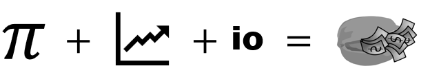
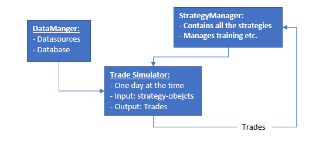

  
### The site is under construction!
## The initial structure:

### DataManager:
**(Status: first version finished, link coming soon.)** 
**Short description:** This component manages the data. It gets the latest data and puts it in the database to limit the calls to the API. This database can later be queried to get the data wanted. 
### StrategyManager: 
**(Status: done)** 
**Short description:** This component manages all the strategies. Since strategies can vary a lot there have to be some abstract classes.
### TradeSimulator: 
**(Status: begun)** 
**Short description:** This component uses multiple threads to accomplish its duty. These are its modes:
* Backtesting: 
The backtesting-mode is used to train the models. A list of strategies is given to the module and it goes through all the data.
* Evaluation: 
In this mode the TradeSimulator is given a list of strategies and is made to evaluate if any of the strategies indicate a that a trade should be made.
